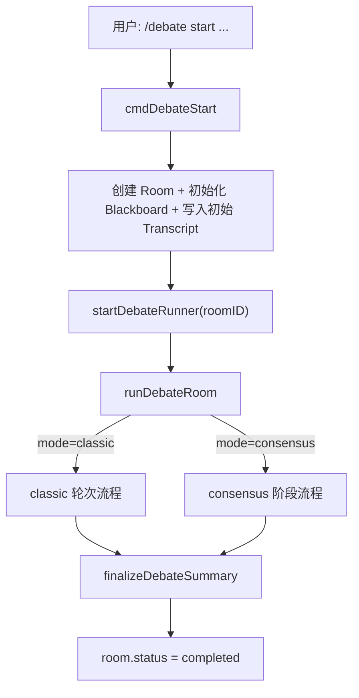
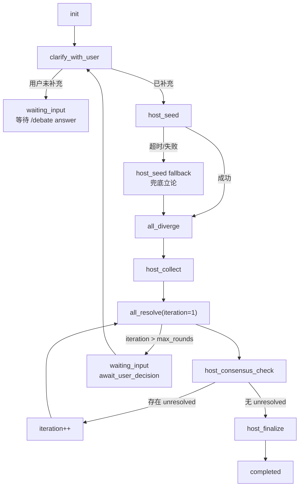
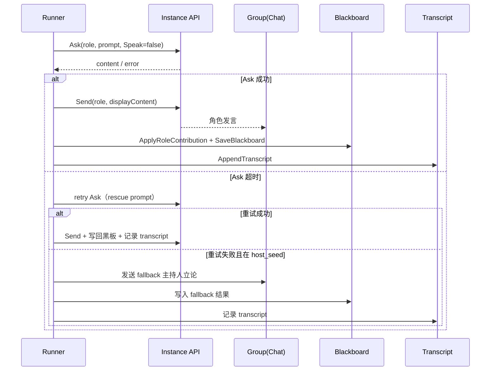

# 多 Bot 讨论控制逻辑详解（精简版）

> 更新时间：2026-03-18  
> 适用：`cc-connect` / `mutil-bot` 分支  
> 本文仅保留：**实现原理 + 时序图/流程图 + 使用说明**

---

## 1. 实现原理（核心）

多 Bot 讨论由 4 个核心数据对象 + 1 个执行器组成：

1. **Room（房间）**
   - 保存讨论元信息：`mode/status/phase/iteration/question/roles`。
   - 是流程状态机的主载体。

2. **Runner（执行器）**
   - 后台协程执行流程。
   - 根据 `mode` 分流：
     - `classic`：按轮次发言
     - `consensus`：按主持人驱动阶段流转

3. **Blackboard（黑板）**
   - 共享上下文：`topic/refined_topic/open_questions/consensus_points/unresolved/role_notes`。
   - 用于跨角色对齐与收敛判定。

4. **Transcript（记录）**
   - 每条发言落盘 JSONL，用于恢复、复盘、总结。

5. **Instance API 调用**
   - `Ask`：向目标角色请求回复（不直接发群）
   - `Send`：将角色回复以该角色名义发到群

---

## 2. 流程图（Flowchart）

## 2.1 顶层控制流（命令到执行）



## 2.2 consensus 阶段流（主持人驱动）



---

## 3. 时序图（Sequence）

下面是“单角色一次发言”的标准时序（classic 和 consensus 通用）：



---

## 4. 容错机制（实现要点）

1. **超时重试**
   - `askDebateRole` 对 timeout 自动重试 1 次。
   - 重试使用 rescue prompt（更短、更聚焦）。

2. **主持人立论兜底（host_seed）**
   - 如果主持人 Ask 连续失败，不中断整场讨论。
   - 自动生成 fallback 主持人立论，继续进入全员发散阶段。

3. **总结门禁**
   - 总结必须包含：结论 / 风险 / 行动项（owner+deadline+验收）。
   - 不合格自动 repair，仍失败则 fallback summary。

---

## 5. 使用说明

## 5.1 启动讨论

### classic（轮次模式）

```text
/debate start --mode classic --rounds 3 --speaking-policy host-decide 请讨论：<话题> @Jarvis
```

### consensus（共识模式，推荐）

```text
/debate start --mode consensus --rounds 4 请讨论：<话题> @Jarvis
```

## 5.2 澄清/拍板（consensus 必用）

```text
/debate answer <room_id> <补充信息或拍板决策> @Jarvis
```

## 5.3 状态查看

```text
/debate status <room_id> @Jarvis
/debate board <room_id> @Jarvis
```

重点看：
- `mode`
- `phase`
- `iteration`
- `unresolved`

## 5.4 手动恢复与停止

```text
/debate continue <room_id> @Jarvis
/debate stop <room_id> @Jarvis
```

---

## 6. 推荐操作顺序（最小闭环）

1. `/debate start --mode consensus ...`
2. 收到澄清问题后，用 `/debate answer ...` 一次给足：目标/范围/非目标/验收标准
3. 用 `/debate status + /debate board` 观察 `phase/unresolved`
4. 若未收敛，继续 `/debate answer` 做拍板
5. 等待 `host_finalize` + 总结输出

